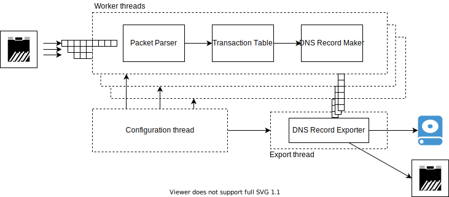

.. _dns-probe-arch:

**********************
DNS Probe architecture
**********************

DNS Probe is implemented as a multithreaded program, see :numref:`figarch`, with one configuration thread, one export thread and a configurable number of worker threads. Each thread is locked to a different logical core of the CPU. This means that the probe requires a CPU with at least three logical cores.

.. _figarch:

   Software architecture of the DNS Probe.

Configuration thread
====================

This is the master thread of DNS Probe. The configuration thread
loads the configuration from the Sysrepo datastore, initializes the network
ports for packet capture, and spawns worker threads and the export
thread. It also locks those threads to CPU's logical cores. For each
spawned thread, the configuration thread creates a two-way
communication link for sending configuration changes to the threads and
for listening to messages from the threads.

After the initial configuration is done, the thread polls the Sysrepo datastore for configuration changes and messages on the communication links.
If a worker or export thread encounters an error, it sends a message
through the communication link to the configuration thread and the
configuration thread is then responsible for shutting down the rest of
the probe. If there's a change of probe's configuration in the Sysrepo
datastore, the configuration thread is alerted and it then distributes
the updated configuration to the rest of the probe's threads. It is also
responsible for periodic aggregation of runtime statistics from all
threads and sending them to the Sysrepo datastore. If time-based
rotation of the output is enabled in probe's configuration, the
configuration thread takes care of the periodic timer and alerts all
threads when it's time to rotate the output.

Initialization of network ports
-------------------------------

The configuration thread initializes one RX queue on a network port per
each spawned worker thread, which then reads packets only
from that RX queue. The distribution of packets to the RX queues is
done using
`RSS <https://www.kernel.org/doc/Documentation/networking/scaling.txt>`_.
A hash value is computed for each incoming packet from a 5-tuple of source
and destination IP addresses, source and destination ports, and
transport protocol. The packet is then assigned to one of the RX queues
based on this hash value.

Backends
========

DNS Probe supports two backends for reading packets from network
ports - AF\_PACKET sockets and DPDK framework.

AF\_PACKET sockets
------------------

The AF\_PACKET sockets are used for packet processing by the
``dns-probe-af`` binary and by the ``dp-af`` script. The `AF\_PACKET
v3
<https://www.kernel.org/doc/Documentation/networking/packet_mmap.txt>`_
is used with ring buffers shared between kernel and user space. Each
RX queue allocates its own ring buffer to which packets are read from
the network port. The ring buffer is separated into blocks. The kernel
reads a batch of packets to the ring buffer's block and then sets the
block's flag indicating that the ownership of the block transfers from
kernel to user space application (DNS Probe). The probe then reads the
packets from the block, processes them and then unsets the block's
flag to give the ownership of the block back to the kernel.

DPDK
----

The `DPDK <https://www.dpdk.org/>`_ framework is used for packet
processing by the ``dns-probe-dpdk`` binary and by the ``dp-dpdk`` script.
This alternative for reading packets bypasses the kernel and reads packets
from a network port directly to the user-space application. This makes
packet input several times faster than with AF\_PACKET sockets. To ensure
a proper distribution of packets to the RX queues (packets of the same
flow going in both directions need to end up in the same RX queue), we use a
`special key <https://www.ndsl.kaist.edu/~kyoungsoo/papers/TR-symRSS.pdf>`_
for the RSS hash function in DPDK.

Worker threads
==============

Worker threads execute the main packet processing pipeline of the probe.
They read packets from RX queues, parse them and create DNS records.
These DNS records are then matched in Transaction table to form a single
record for each pair of DNS request and response. After accumulating
enough records the worker thread then sends them through a ring buffer
to the export thread.

DNS Probe handles DNS traffic transported by both UDP and TCP. Since
the probe does all the packet parsing itself, it implements a slightly
modified version of `TCP finite machine
<https://tools.ietf.org/html/rfc793#page-23>`_ and a reordering buffer
to properly reconstruct TCP streams and extract DNS traffic from
them. DNS data itself is parsed by the probe and certain items are
extracted from it to form a request or response DNS record.  This DNS
record is then inserted to the Transaction table.

Transaction table is a hash table for matching DNS requests with
responses. The matching is done based on a 6-tuple of source IP address,
destination IP address, source port, destination port, transport
protocol and DNS ID. Optionally, the user can enable additional matching
based on the QNAME field from DNS question section. If a request is
matched with a response, these two records are merged into one and
buffered for output.

Once enough DNS records are buffered on the worker thread or time-based
output rotation is triggered, the worker thread sends the object with
buffered DNS records to the export thread via a ring buffer.

Export thread
=============

The export thread handles export of DNS records to output. The probe
supports export either to a local file or directly to a remote location
via encrypted network transfer using TLS.

The export thread has a ring buffer for each of the worker threads.
Through these ring buffers it accepts DNS records from worker threads
and writes them to output. The output can be rotated based on the amount
of data written, or on the time elapsed
since the start of the current output. These parameters can be
configured by the user.

Depending on the configuration, output data can be exported in one of
two formats - `Parquet <https://parquet.apache.org/>`_ or C-DNS
[RFC8618]_. Exported data can be optionally compressed with GZIP. As
long as the current output file is open, its name has the ``.part``
suffix, which is removed once the output file is closed. The Parquet
and C-DNS output files have the sufix ``.parquet`` and ``.cdns``
suffix, respectively. If GZIP compression is enabled, a C-DNS output
file receives an additional suffix ``.gz``. However, this is not done
for Parquet output files because the Parquet format doesn't compress
the whole file – the compression is used internally only on certain
parts of it.
